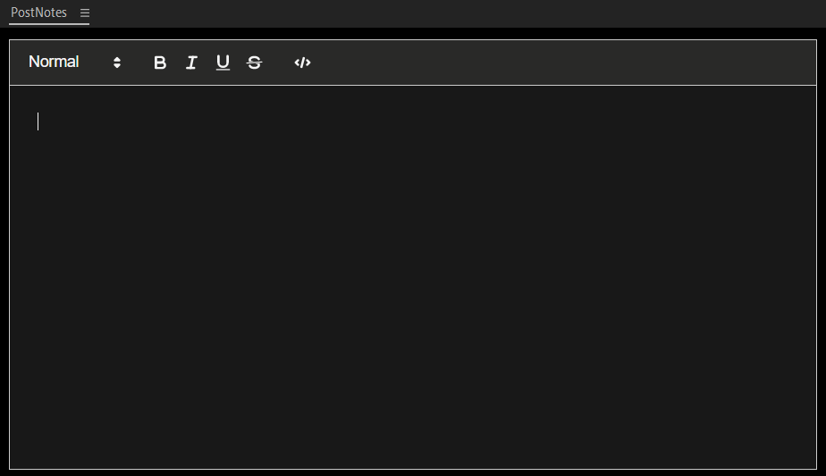

# PostNotes
Premiere pro extension

This simple extension adds a simple notepad window to your premiere project without need to pay 20$.

**Right now this version doesn't support file saving, because I couldn't get it to work.**

### Preview

### Installation
- Download this repo
- Copy **PostNotes directory** to the `C:\Program Files\Adobe\Adobe Premiere Pro <your-version>\CEP\extensions`
- Reload premiere pro
- In the extensions tab, click on PostNotes 
